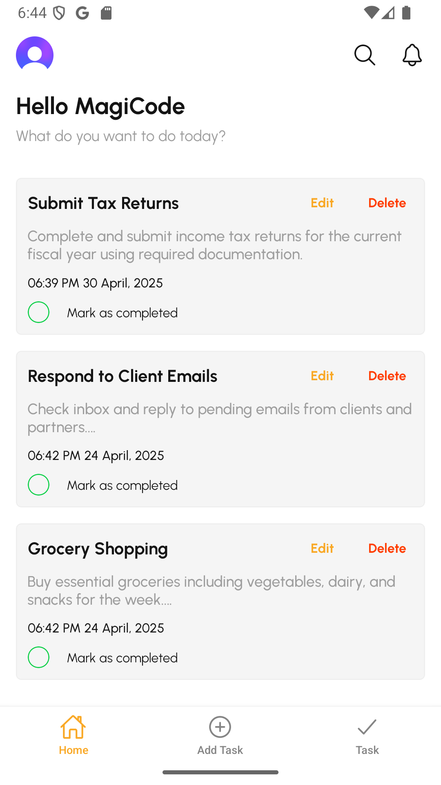
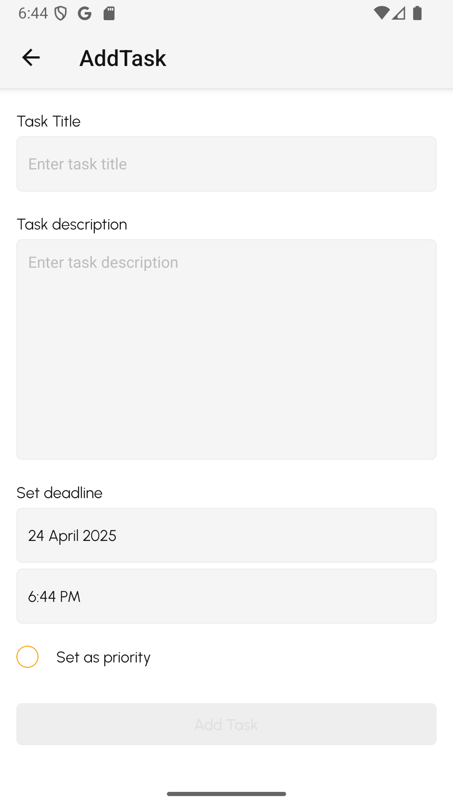
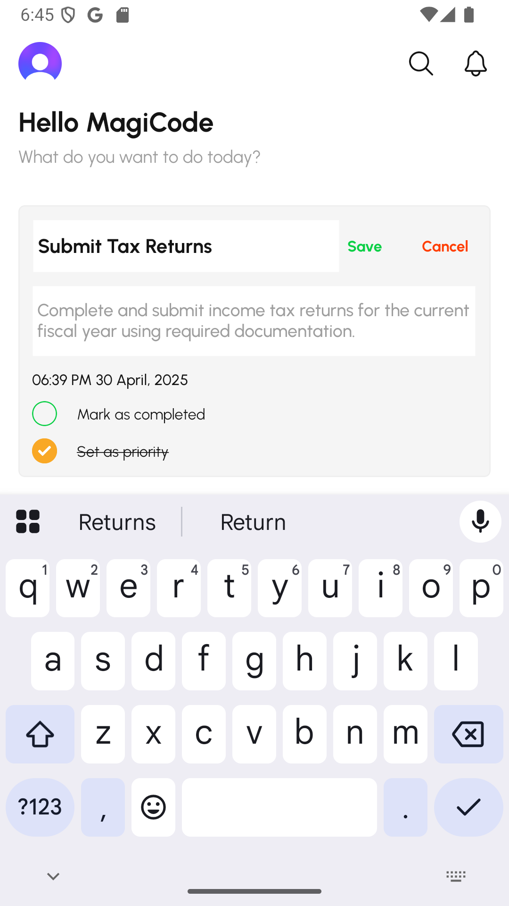

# Todo Now App

A modern, feature-rich todo application built with React Native (Expo) and Convex backend. This app helps you manage your tasks efficiently with priority settings, due dates, and task status tracking.

## Features

- **User Authentication**: Secure login and registration using Clerk
- **Task Management**:
  - Create, edit, and delete tasks
  - Mark tasks as completed/in-progress
  - Set priority flags for important tasks
  - Set due dates with date and time picker
- **Task Organization**:
  - Search functionality to find specific tasks
  - Filter tasks by status (completed/in-progress)
  - Sort tasks by priority and due date
- **User Profile**: View and manage your profile information
- **Responsive UI**: Beautiful and intuitive interface with animations
- **Real-time Updates**: Changes sync instantly across devices
- **Error Tracking**: Sentry integration for monitoring and debugging
- **Quick Actions**: Support for app shortcuts and quick actions
- **Offline Support**: Basic offline functionality with secure storage
- **Push Notifications**: Task reminders and updates

## Screenshots

<!-- Add your screenshots here from assets/screenshots directory -->

| Home Screen                            | Add Task Screen                                | Task Details                                           |
| -------------------------------------- | ---------------------------------------------- | ------------------------------------------------------ |
|  |  |  |

## Tech Stack

### Frontend

- **React Native** (v0.79.2) with **Expo** (v53.0.8) - Mobile app framework
- **TypeScript** - Type-safe JavaScript
- **Expo Router** - File-based navigation system
- **React Hook Form** - Form handling with validation
- **Zod** - Schema validation
- **React Native Reanimated** - Animations
- **React Native Unistyles** - Styling system
- **date-fns** - Date utility library
- **React Native Gesture Handler** - Gesture management
- **React Native Pager View** - Swipeable views
- **React Native Bouncy Checkbox** - Custom checkbox component

### Backend & Services

- **Convex** - Backend-as-a-service for real-time data
- **Clerk** - Authentication and user management
- **Sentry** - Error tracking and monitoring
- **EAS** - Expo Application Services for builds and updates

## Getting Started

### Prerequisites

- Node.js (v14 or higher)
- Bun package manager (recommended) or npm
- Expo CLI
- EAS CLI (for builds and updates)

### Installation

1. Clone the repository

   ```bash
   git clone <repository-url>
   cd todo_now_app
   ```

2. Install dependencies

   ```bash
   bun install
   ```

3. Start the development server
   ```bash
   bunx expo start
   ```

## Available Scripts

- `bun run android` - Run the app on an Android device/emulator
- `bun run ios` - Run the app on an iOS simulator
- `bun run release:android` - Run the app in release mode on Android
- `bun run update:app` - Update the app with EAS Update and upload sourcemaps to Sentry
- `bun run publish:android` - Build Android app for preview
- `bun run lint` - Lint the code
- `bun run format` - Format the code with ESLint and Prettier
- `bun run upgrade` - Upgrade Expo and fix dependencies

## Development

The project follows a structured architecture:

- `src/app` - Main application routes using Expo Router
- `src/components` - Reusable UI components
- `src/styles` - Styling configuration using Unistyles
- `src/types` - TypeScript type definitions
- `src/validations` - Form validation schemas using Zod
- `convex` - Backend API and schema definitions
- `assets` - Static assets and screenshots

## Testing

The project uses Jest for testing:

- `bun test` - Run all tests
- `bun test:watch` - Run tests in watch mode

## Error Tracking

The app uses Sentry for error tracking and monitoring:

- Automatic error reporting
- Performance monitoring
- Source map uploading for better error tracking
- Custom error boundaries

## Lessons Learned

- Building a real-time application with Convex backend
- Implementing robust forms with validation using React Hook Form and Zod
- Creating a performant mobile app with React Native and Expo
- Using file-based routing for navigation with Expo Router
- Managing state efficiently across the application
- Implementing authentication with Clerk
- Creating smooth animations with React Native Reanimated
- Setting up error tracking with Sentry
- Implementing app shortcuts and quick actions
- Managing secure storage for offline functionality

## License

[MIT License](LICENSE)
